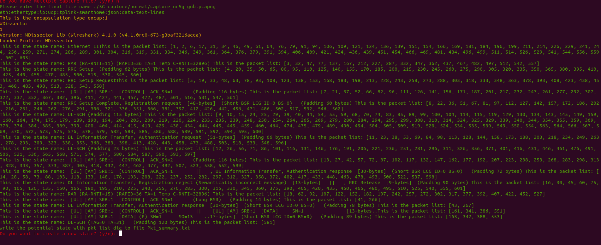
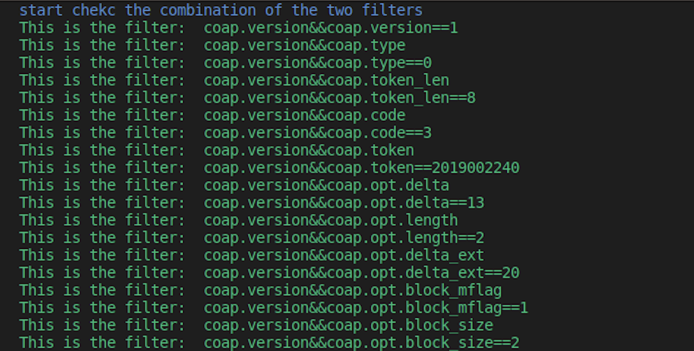
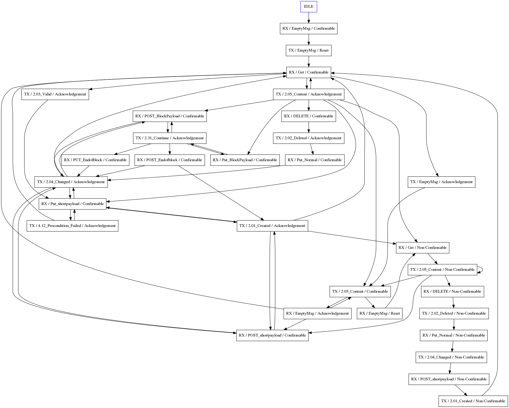
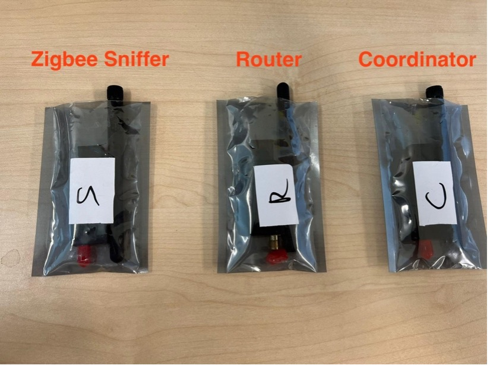

# U-Fuzz
COTS_IoT_Fuzzer is a framework to systematically discover and replicate security vulnerabilities on arbitrary wired and wireless IoT protocol (e.g., CoAP, Zigbee, 5G NR) implementations. COTS_IoT_Fuzzer offers possibility to automatically construct the fuzzing statemachine with only a few packet traces of normal (i.e.,benign) communication. 

## Software Environment
**OS:** Ubuntu 18.04
**Wireshark Version:** V4.1 (patched)
**Bindings:** Python3, Golang

## Compile from the source
Several requirements needs to be installed before compiling the project. An automated script for Ubuntu 18.04 is provided on `requirements.sh`. To compile from source, simply run the following commands:
```
$ Download the content from this github link:
https://anonymous.4open.science/r/cots-iot-fuzzer/

$ cd wdissector

$ ./requirements.sh dev # Install all requirements to compile wdissector from source

$./requirements.sh doc  # Install nodejs requirements to generate documentation

$./build.sh all # Compile all binaries. It may take around 15min. Go get a coffe!
```

## Running the multi-protocol Statemapper
Before running the fuzzer, the multi-protocol Statemapper need to be run to generate both the configuration file and the state model.

the multi-protocol-statemapper needs two inputs,

1: Capture_trace_for target_protocol.pcapng(can input via terminal)
2: configuration templete to append the mapping rules needs to specify the file name in "multi_protocol_state_mapper.py :line: 423"
After compile from the project with the correct software environment, please run the following command with the two inputs mentioned previously.
```
$ cd .../cots-iot-fuzzer/multi_protocol_statemapper/wdissector

$ python3 multi_protocol_state_mapper.py
```

# Manual Mode Running details

Step1: input the final capture trace

```
user can choose to combine multiple capture file by themselves
or use U-Fuzz combiner by input y.
```

Step2: After the capture analysis all the potential state and pkt list 
will be print out, user can proceed to form new state by entering y then the 
potential pkt lst (can copy and paste from above).




After the initial pkt list was input, if the user wants to continuously input packets,
they can input 'y' for the follow question, or can just input 'n' to proceed.


Step3: After the potential pkt list was input, the capture processor will out put all the 
common layers which shared by all packets the user just input, then analysis form the most 
relevant layer.


In the mean time, the user needs to input a name for that state, can copy and paste from above also.


Step4: one by one analysis will be performed


then followed by 2 by 2 if filer was not found by 1 by 1.



Step5: Once the filter is found, user can decide to continuously create new state by input 
'y' or stop by input 'n'.


Step6: Once 'n' was input for the previous step, three input will be asked for the statemachine 
generation

1. previous inputed Capture file 
2. Tamplete config file
3. The outfile name, (.json is for the statemachine generatoin, .png is for the statemachine image generation)


# Model representation figure



## Running the fuzzer
1. Zigbee

**Step1:**
*build the project (zigbee_real_time_fuzzer)*

```
Edit the CMakeLists.txt
$ Uncomments line:802, 810-814
$ Comments line: 804, 824-828

$ ./build.sh all

```
**Step2:**

*install Zigbee2Mqtt *from link: https://www.zigbee2mqtt.io/
the sample configuration file is located at 
cots-iot-fuzzer/zigbee_dongle_connection/coordinator/data

**Step3:**

*prepare the hardware * for fuzzing Zigbee including coordinator dongle (e.g., CC2531 ZNP-Prod)
and zigbee smart devices 



**Step 4:**
*Run the fuzzer *

```
open a new terminal then run 
$ mosquitto

run the fuzzer at directory
$ cd cots-iot-fuzzer/
$ sudo bin/zigbee_real_time_fuzzer --EnableMutation=true

$ cd zigbee_dongle_connection/coordinator
$ docker-compose up
```

2. CoAP

**Step1:**
*build the project (coap_realtime_fuzzer)*
```
$ ./build.sh all

```
**Step2:**
Set up target CoAP sever implementation (e.g., Libcoap)

**Step3:**
*Run the Fuzzer*
```
$ Run CoAP Server

$ cd cots-iot-fuzzer/
$ sudo bin/coap_realtime_fuzzer --EnableMutation=true
$ cd cots-iot-fuzzer/coap_client_server
$ sudo ip netns exec veth5 node client_complete.js
```
3. 5G

## Approach 1:

$ cd */wireless-deep-fuzzer/5gcontainer

$ chmod +x container.sh

$ ./container.sh run release-5g

If just wanna run the 5G simulator can use the following command
$ sudo bin/lte_fuzzer --EnableSimulator=true

if wanna run 5G fuzzing with real UE, please contact me before running the experiment then i can prepare the fuzzing setup for testing.

##Approach 2: 

Download the 5G container from the docker hub

Credential: 

```
docker login -u a80568681433

Access token:
dckr_pat_A7VRSeNGp_tJPhIAuk4Iksk0pxM
```
```
$ chmod +x container.sh
$ ./container.sh run release-5g
$ sudo bin/lte_fuzzer  --EnableSimulator=true
```
